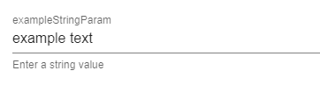
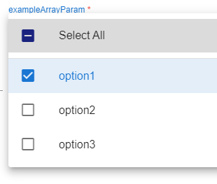
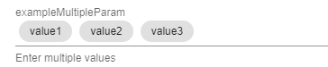

# Understanding TIM's Templated Queries

This document outlines the expected structure for templated query YAML.

## YAML Structure

When creating or importing a templated query, the following YAML keys are expected. For simplicity, it is recommended that you initially create a templated query via TIM's Query Manager UI, rather than starting from raw YAML. If desired, you can then export the templated query's YAML to view and modify directly.

- `name`: The name of the query as shown in the Query Manager UI.
- `queryType`: The type of the query, either `View` or `Query`.
  - A `View` is a template that **isn't** used for pivoting and so does not define any `fields` key
  - A `Query` is a template that **is** used for pivoting as defined by the `fields` key
- `menu`: The menu entry for the query. This is what shows up in the right-click pivot context menu.
- `summary`: A brief summary of the query, with placeholders for dynamic values. This is what shows up in the left-side pane once the query is executed.
- `path`: Defines the hierarchical path for the query.
- `cluster`: The URL of the cluster where the query will be executed.
- `database`: The name of the database to query.
- `columnId`: The column used as a unique identifier for events.
- `params`: Optional parameters for the templated query (can be `null` if not used). [See Params](#params)
- `fields`: Fields for the templated query. Only used if `queryType` is `Query`. [See Fields](#fields)
- `columns`: Default column display options for the templated query. [See Columns](#columns)
- `query`: Actual query logic to be executed.

The below headings provide additional detail on the more complex key structures; Params, Fields, and Columns.

## Params

Query `params` define the parameters for templated views/queries. 

These optional parameters allow for variables used by the templated query to be easily input/changed at run time in order to modify the results it returns.

**Note**: *Params* are not to be confused with *fields*. [*Fields*](#fields) are similar to *params* but are specifically used for defining the fields required from the source data in AG Grid when performing a *pivot*. 

For example, you may have a parameter named `limit` that sets a default limit of results returned by the templated query to 500, but allows for the user to easily change this number to return more/less results. The `limit` param would then be available for insertion into the `query` body via Handlebars mustache templating, e.g. `{{limit}}`. The value of `{{limit}}` can then be parsed, manipulated, and used in the query logic as desired. 

**Note**: Handlebars additionally has some built-in helpers such as `#if`, `#unless`, `#with`, and `#each` that can be used to change the functionality of the templated query based on your parameters. See the `exampleBooleanParam` KQL example for a simple example of this.

The following provides an overview of the possible YAML keys and values supported for each defined parameter.


| Field       | Type                | Description                                           | Required |
|-------------|---------------------|-------------------------------------------------------|----------|
| `default`   | object              | Default value for the parameter.                      | No       |
| `type`      | string              | Type of the parameter. See Supported `type` values below. | Yes      |
| `optional`  | boolean             | Indicates if the parameter is optional.               | No       |
| `multiple`  | boolean             | Indicates if multiple values are allowed for the parameter. Currently only used if using the `array` type. | No       |
| `hint`      | string              | Hint text for the parameter.                          | No       |
| `values`    | array               | Possible values for the parameter if the type is 'array'. | No (Yes if type is 'array') |

### Supported `type` values

The following parameter types are supported, which define how the parameters get rendered and additionally how data is input/stored for the parameter.

- `String`: Rendered as a text field. Any type that isn't Boolean, Array, or Multiple will be rendered as a text field.
- `Boolean`: Rendered as a toggle switch.
- `Array`: Rendered as a select field to choose from preset values. Optionally set `multiple: true` to allow selecting multiple values.
- `Multiple`: Rendered as a combobox.


### String Type Example
Example YAML:
```yaml
exampleStringParam:
  type: string
  default: "example text"
  hint: "Enter a string value"
  optional: true
```

Rendered as a text field:



Example usage in KQL query:

```
let _timestamp = datetime({{exampleStringParam}});
```


### Boolean Type Example
Example YAML:
```yaml
exampleBooleanParam:
  type: boolean
  default: true
  hint: "Toggle the switch"
  optional: false
```
Rendered as a toggle switch:


Example usage in KQL query:

```
{{#if exampleBooleanParam}}
add some additional query logic here that will only be inserted in the KQL query if the exampleBooleanParam toggle is set to true...
{{/if}}
```

### Array Type Example
Example YAML:
```yaml
exampleArrayParam:
  type: array
  multiple: true
  values:
    - "option1"
    - "option2"
    - "option3"
  default: "option1"
  hint: "Select an option"
  optional: false
```
Rendered as a select field to choose from preset values. Optionally set `multiple: true` to allow selecting multiple values:



Example usage in KQL query:

```
let _exampleArray = split("{{exampleArrayParam}}", ',');
```

### Multiple Type Example
Example YAML:
```yaml
exampleMultipleParam:
  type: multiple
  hint: "Enter multiple values"
  optional: true
```

Rendered as a combobox:



Example usage in KQL query:

```
let _exampleMultipleParam = pack_array({{array exampleMultipleParam}});
```


## Fields

Query `fields` define the pivot fields for templated queries. 

*Fields* are required when creating a templated *query* to define the fields to be retrieved from the source data in AG Grid when performing a pivot. 

**Note**: *Fields* are not to be confused with *params*. [*Params*](#params) are similar to *fields* but are specifically used for defining the non-pivotable parameters for a templated query.

For example, you may have data in AG Grid that exposes an `account` column that you'd like to pivot on. You could generate a templated query for which you then define an `account` *field* in order to pivot and run a new query based on that source `account` column. 

The `account` field would then be available for insertion into the `query` body via Handlebars mustache templating, e.g. `{{account}}`. The value of `{{account}}`can then be parsed, manipulated, and used in the query logic as desired. 

**Note**: Handlebars additionally has some built-in helpers such as `#if`, `#unless`, `#with`, and `#each` that can be used to change the functionality of the templated query based on your parameters/fields. See the `exampleBooleanParam` KQL example for a simple example of this.

The following provides an overview of the possible YAML keys and values supported for each defined field.

| Field       | Type                | Description                                           | Required |
|-------------|---------------------|-------------------------------------------------------|----------|
| `type`      | string              | Type of the field. See Supported `type` values below. | Yes      |
| `from`      | string              | Origin of the field. Currently used only if type is `multiple`.  | No (Yes if type is 'multiple') |
| `regex`     | string              | Regular expression for the field. Required if type is `match`. | No (Yes if type is 'match') |

### Supported `type` values

The following field types are supported, which define how the source data being pivoted on is identifed, retrieved, and stored.

- `string`: Simplest type of pivot, where the name of the defined *field* itself is what is retrieved from the source data.
- `multiple`: Allows multiple values (from the same column) to be retrieved from the source data via selecting and pivoting on multiple rows of data. Values will be retrieved from the column specified by the `from` field, which is required when using the multiple type. Retrieved data is rendered as a combobox.
- `match`: Similar to the `string` type, but enables regex matching to determine the column(s) to be retrieved from the source data. Regex is defined in the `regex` field, which is required when using the match type. This is useful when you want to pivot on something like an IP address, but want to be able to select whether you're pivoting on the source IP, destination IP, etc.
  - If only one suitable column is found via the regex match, that column's value is input/rendered as text
  - If more than one suitable column is found via the regex match, a multi-select dropdown is rendered for the user to choose which column/value they desire to use before runing

### String Type Example
Example YAML:
```yaml
exampleStringField:
  type: string
```
Example usage in KQL query:

```
let _pivotString = "{{exampleStringField}}";
```

### Multiple Type Example
Example YAML:
```yaml
exampleMultipleField:
  type: multiple
  from: ChooseYourSourceColumnName
```
Example usage in KQL query:

```
let _pivotArray = split('{{exampleMultipleField}}', ',');
```


### Match Type Example
Example YAML:
```yaml
exampleMatchField:
  type: match
  regex: _IP$|^SourceIP$|^DestIP$
```
Example usage in KQL query:

```
let _pivotString = "{{exampleMatchField}}";
```
## Columns

Defines the columns and column order to be displayed by default in the query results. Additionally, AG Grid properties can be applied to control its visibility and layout, e.g. `flex` shown below.

Example YAML:

```yaml
default:
  hide: A boolean indicating if all columns not explicitly listed as `hide: false` should be hidden by default.
exampleColumn:
  hide: A boolean indicating if `exampleColumn` should be hidden by default
  flex: The `flex` property in AG Grid is used to control the width of columns when displaying data, based on available space.
```
