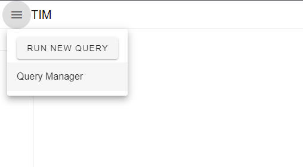
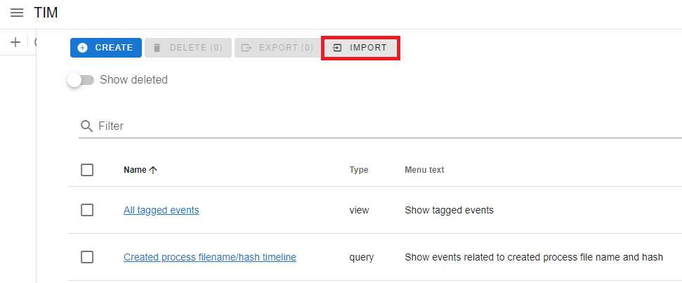

# Templated Query Packs

This folder contains collections of sample templated queries that can be imported via TIM's Query Manager and used with various datasources. The queries are organized by folder according to which product telemetry or datasource the queries are intended to be used with.

Notably, use the templated queries in the [Tagged Events](./Tagged%20Events/) folder to retrieve your TIM tagged events, regardless of the datasources used.

To import queries, click on the hamburger menu in the upper-left and select 'Query Manager':

Then click on the IMPORT button and choose .yaml, .yml, or .zip files containing YAML to upload:

*Please note that these queries are being provided for example only and may require modifications before running.*